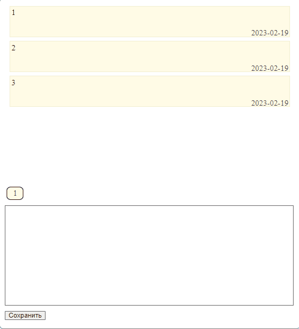

# web-notes-2
Web notes features:

1. Adding notes;

2. Editing notes;

3. Deleting notes;

In the "setting.php" file, you need to change the database connection parameters.

The "list_notes.sql" file - database file.

